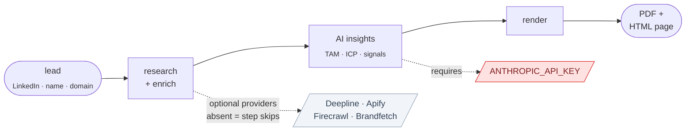
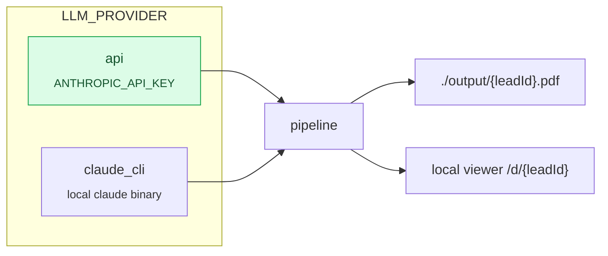
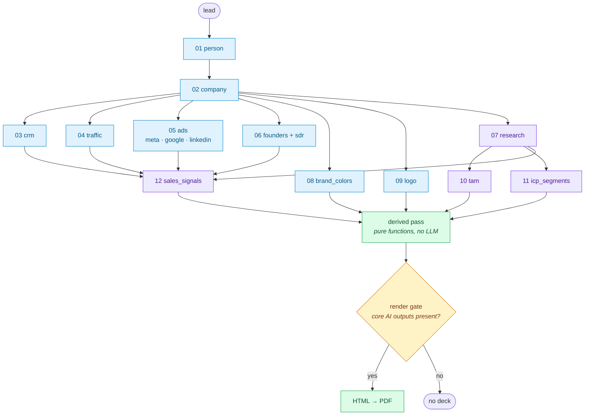

# Microsite Pipeline

[](https://github.com/udaykang-byte/microsite-pipeline/actions/workflows/ci.yml)
[](LICENSE)

Turn a single sales lead into a personalized, on-brand 8-page sales microsite (a PDF plus an HTML page) that pitches GTM Engineering services to that specific company.

Give it a lead (a LinkedIn URL, a name, a company domain). It researches the company, generates AI insights (TAM, ICP segments, sales signals), and renders a deck built from real data. **No fabricated numbers:** when a source is missing, the field is dropped, not invented.

This is a **bring-your-own-key** tool. You run it locally with your own API keys; nothing is sent to a server we control. With just an Anthropic API key you get a working (lighter) microsite; add more provider keys to fill in more of the deck.



---

## Before you start

You need three things:

- **Node.js 20 or newer** (`node --version`). The pipeline uses `node:` imports and builds `better-sqlite3` natively, so older versions fail at install.
- **An Anthropic API key** — [console.anthropic.com](https://console.anthropic.com/settings/keys). This is the only required key.
- **~500MB of disk** for Chromium, which Playwright downloads to print the PDF.

**What a run costs.** With the default `api` setup, one lead is a handful of Claude calls (research, TAM, ICP, signals) — typically a few US cents. Every step logs its own `cost_usd` and each run prints a per-step summary, so you can see the real number rather than trust an estimate. Optional providers bill separately under their own pricing.

---

## 60-second quickstart

```bash
# 1. Install deps + Chromium (page.pdf needs the headless shell)
npm ci
npx playwright install chromium chromium-headless-shell

# 2. Guided setup — asks what you want, verifies your keys, writes .env
npm run setup

# 3. Confirm what will run vs skip with your keys
npm run doctor

# 4. Generate a microsite for one lead (no CSV needed)
npx tsx scripts/run.ts --lead-url "https://www.linkedin.com/in/some-founder" \
  --name "Jane Doe" --company "theircompany.com"

# 5. View it in a browser
npx tsx scripts/serve.ts        # then open the printed URL

# 6. (optional) Export everything it produced — the full research brief and
#    every enriched field — for review
npx tsx scripts/inspect.ts <leadId>
```

`npm run setup` is an interactive wizard: it walks through the switches, asks only for the keys you want, **checks each one against the real API as you paste it**, and writes a `.env` that keeps all the explanatory comments. Every optional key can be skipped with Enter.

Prefer to do it by hand, or setting up in CI? `npx tsx scripts/init.ts` copies the template without prompting and leaves the editing to you.

> **Want it spelled out?** [**SETUP.md**](SETUP.md) has step-by-step instructions for both [Claude Code users](SETUP.md#path-a--with-claude-code) and [plain-terminal users](SETUP.md#path-b--without-claude-code), plus a fuller troubleshooting table.

Your deck lands in `./output/{leadId}.html` and `.pdf`. Open the HTML directly, or use the viewer in step 5.

---

## What you get

An 8-page deck built for one specific company, in two formats: a **PDF** to attach, and an **HTML page** to view locally or host wherever you like.

| Page | Content |
|------|---------|
| 1 | Cover — their logo, their brand colors, their company name |
| 2 | Their current GTM snapshot — traffic, founder followers, ad activity, SDR headcount |
| 3 | ICP segments — who they should be selling to |
| 4 | TAM (total addressable market) — a three-tier funnel from sourced research |
| 5 | Sales signals — three concrete openings worth acting on |
| 6 | Integration — plugs into their detected CRM |
| 7 | Proof |
| 8 | The pitch |

The long-form research brief behind pages 3–5 isn't a deck page — export it (plus every other stored field) with `npx tsx scripts/inspect.ts <leadId>`.

Pages fill in from whatever your keys support. **Anything unsourced is dropped, not invented** — a deck with fewer keys is shorter, never fabricated.

Want to see the shape before running anything? [`templates/microsite/index.html`](templates/microsite/index.html) is the raw template, and `npx tsx scripts/doctor.ts` prints exactly which steps will run or skip with your current `.env`.

---

## The switch

Results always live locally (a SQLite file + `./output` — zero accounts). The switches (defaults shown):

| Switch | Default | Options | What it means |
|--------|---------|---------|---------------|
| `LLM_PROVIDER` | `api` | `api` \| `claude_cli` | `api` = the Anthropic API with your `ANTHROPIC_API_KEY`. `claude_cli` = a local `claude` binary on a Claude subscription. |
| `RESEARCH_PROVIDER` | `claude` | `claude` \| `parallel` \| `perplexity` | Which backend writes the step-07 research brief. The default reuses your LLM with web search — no extra key. |
| `ADS_TRAFFIC_PROVIDER` | `auto` | `auto` \| `apify` \| `deepline` | Which provider runs traffic + ad counts (steps 04/05). See [the route table below](#choosing-the-trafficads-route-apify-or-deepline). |

With the default (`api`) the only required key is `ANTHROPIC_API_KEY`.



<sub>Green = the default. Everything works with no accounts beyond an Anthropic key.</sub>

---

## What each key unlocks

Every provider key is optional. A step whose key is absent **skips cleanly**, and the deck still renders from whatever data you do have (missing pieces are dropped, never faked). `scripts/doctor.ts` prints this as a live RUN/SKIP table for your `.env`.

| Key | Unlocks |
|-----|---------|
| **`ANTHROPIC_API_KEY`** (required) | Research brief + TAM, ICP segments, and sales signals — the core of the deck |
| `DEEPLINE_API_KEY` | Person + company enrichment, founders, SDR headcount (steps 01/02/06) — **and** traffic + Meta/Google/LinkedIn ad counts (steps 04/05) via its native DataForSEO and Adyntel tools |
| `APIFY_TOKEN` + `APIFY_ACTOR_*` | Website traffic and Meta/Google/LinkedIn ad counts (steps 04/05) via Apify actors |
| `FIRECRAWL_API_KEY` | Stronger CRM detection, brand colors, and logo scraping (a plain fetch is used without it) |
| `BRANDFETCH_API_KEY` | Cleaner logo lookup (step 09) — both theme variants are stored, and the renderer picks the one that suits the deck's brand background |
| `PARALLEL_API_KEY` / `PERPLEXITY_API_KEY` | Alternative research backends (set `RESEARCH_PROVIDER` accordingly) |

Without `DEEPLINE_API_KEY`, pass a `--company <domain>` and the pipeline seeds the company directly so the research and rendering steps still run — an **Anthropic-only** run.

### Choosing the traffic/ads route: Apify or Deepline

Steps 04/05 (traffic + ad counts) can run through **either** provider — pick with `ADS_TRAFFIC_PROVIDER` in `.env`:

| Value | Behavior |
|-------|----------|
| `auto` (default) | Apify when its token/actors are configured; Deepline's native tools (DataForSEO traffic, Adyntel ad libraries) as the fallback when Apify is unconfigured or errors (e.g. a monthly usage limit) |
| `apify` | Apify only — Deepline is never called for these steps |
| `deepline` | Deepline only — no Apify account or actor picks needed; one `DEEPLINE_API_KEY` covers traffic and all three ad channels |

Note the traffic semantics differ per route: Apify's SimilarWeb actor reports **total site visits**, while Deepline's DataForSEO tool reports **estimated monthly Google-search visits** (organic + paid). The stored `source_field` records which one a lead's number came from.

---

## Usage

```bash
# One ad-hoc lead, no CSV (seeds + runs end to end)
npx tsx scripts/run.ts --lead-url <linkedin> --name "<name>" --company <domain>

# Seed many leads from leads.csv (header: url, first_name, last_name, company, position)
npx tsx scripts/seed.ts
# ...then process pending rows
npx tsx scripts/run.ts --batch 50

# Re-run one existing lead by id
npx tsx scripts/run.ts --lead <uuid>

# Force one step to rerun (e.g. after a fix)
npx tsx scripts/run.ts --lead <uuid> --force --step <name>

# What will run with my keys?
npx tsx scripts/doctor.ts

# View rendered decks locally
npx tsx scripts/serve.ts

# Inspect everything the pipeline produced for a lead (Clay-table equivalent):
# writes output/<id>.report.md + output/<id>.research.md and prints the report
npx tsx scripts/inspect.ts            # no args: list leads
npx tsx scripts/inspect.ts <uuid>

# Tests (pure functions stay 100% covered)
npm test
```

`--company` is the company **domain** (e.g. `smartlead.ai`). Secrets live only in `.env` (gitignored) — never commit or paste key values.

### Follow-up decks (skim queue + deploy)

Every processed lead also gets a **follow-up deck draft**: a single scrolling
pitch page (diagnosis of their business → your playbook for them → your case
studies → one call CTA), personalized from the pipeline's research and framed
around the proof content in `content/proof-library.yaml` (yours to edit —
metrics render verbatim, the LLM only selects and frames). Drafts stay local;
a page only goes live through an explicit `approve`, which deploys it to a
prospect-named Netlify subdomain (needs `NETLIFY_AUTH_TOKEN` in `.env`).

```bash
# Review queue: drafts awaiting review, deployed, failed
npx tsx scripts/followup.ts list

# Read the ~30-line skim (every claim + the data point it rests on)
npx tsx scripts/followup.ts preview <uuid>

# Fold in call notes (post-call mode), then regenerate
npx tsx scripts/followup.ts notes <uuid> "They said churn is the burning issue"
npx tsx scripts/followup.ts regenerate <uuid> --steer "lean into retention"

# Publish (prospect-named subdomain, e.g. acme-growth-plan.netlify.app)
npx tsx scripts/followup.ts approve <uuid> --dry-run
npx tsx scripts/followup.ts approve <uuid>
```

---

## Troubleshooting

| Symptom | Fix |
|---------|-----|
| `npm ci` fails building `better-sqlite3` | You're on Node < 20. Check `node --version` and upgrade. |
| PDF step fails / "browser not found" | Chromium wasn't installed. Run `npx playwright install chromium chromium-headless-shell`. |
| Fail-fast on startup about a missing key | `ANTHROPIC_API_KEY` isn't set in `.env`. Run `npm run setup`, or add it by hand. |
| `setup` says "needs an interactive terminal" | The wizard prompts, so it can't take piped input. Run it directly, or use `npx tsx scripts/init.ts` for a non-interactive setup. |
| Render gate rejects the lead | The core AI outputs are required (TAM, 2+ ICP segments, 3 sales signals). Run `doctor.ts` to see which step skipped, and check that step's recorded error. |
| Lots of steps show SKIP | Expected — those providers' keys are absent. The deck still renders at lower fidelity. |
| A step failed and you fixed the cause | Reruns skip `done` steps. Force one: `npx tsx scripts/run.ts --lead <uuid> --force --step <name>`. |

---

## How it works

The pipeline is a dependency-ordered DAG. Each step writes its raw output and records its state (`done` / `error` / `skipped` / `blocked`) plus cost — `blocked` marks a step waiting on an errored dependency, retried automatically on the next run. Reruns only re-execute failed or missing steps, so the expensive research step never repeats unnecessarily.



<sub>Blue = provider/deterministic steps · purple = LLM steps · green = pure functions · amber = the gate that decides whether a deck exists.</sub>

- **Steps 01–12** gather and synthesize data. Steps 07/10/11/12 use the LLM (`LLM_PROVIDER`); the rest are deterministic or provider calls.
- The **derived pass** computes deterministic deck copy (traffic/follower/SDR/ad insights, the TAM funnel) — pure functions in `src/pure/`, no LLM.
- The **render gate** requires the core AI outputs (TAM, 2+ ICP segments, 3 sales signals). Logo, brand color, and qualification are only required under `RENDER_STRICT=true`; by default they degrade gracefully.
- The **render pass** interpolates the HTML template and prints a PDF with Playwright + Chromium.

---

## Design principles

1. **No fabricated data.** A missing provider means a dropped field, never an invented number, email, color, or logo.
2. **Deterministic beats LLM.** CRM detection, brand colors, the ad summary, and every formula are pure, unit-tested functions in `src/pure/`. LLMs are used only for research, TAM, ICP, and signals.
3. **Idempotent steps.** A `done` step is skipped unless forced; research (the expensive one) never reruns implicitly.
4. **Graceful degradation.** Bring one key or ten — you always get an honest deck at the fidelity your keys support.
5. **Cost logging.** Every step records `cost_usd` and `provider`; runs print a per-step summary.

---

## Repo structure

```
src/
  db.ts               # config + switches (loads .env once)
  pipeline.ts         # DAG runner: order, concurrency, retries
  state/              # local state backend (SQLite + ./output)
  providers/          # llm (api/cli dispatch) + deepline, apify, firecrawl, ...
  steps/              # 01..12 pipeline steps (each declares dependsOn)
  pure/               # deterministic, unit-tested helpers (no I/O)
  render.ts           # render pass: HTML → PDF → artifact
prompts/              # LLM prompt templates
templates/microsite/  # the HTML deck template (interpolated per lead)
scripts/              # setup (interactive), init, run, seed, doctor, serve
```

---

## Contributing

Issues and pull requests are welcome — see [CONTRIBUTING.md](CONTRIBUTING.md) for setup and conventions. Tests are pure and mocked, so `npm test` passes without any API keys.

To report a security issue, see [SECURITY.md](SECURITY.md). Please don't open a public issue for vulnerabilities.

---

## License

Released under the [MIT License](LICENSE).
