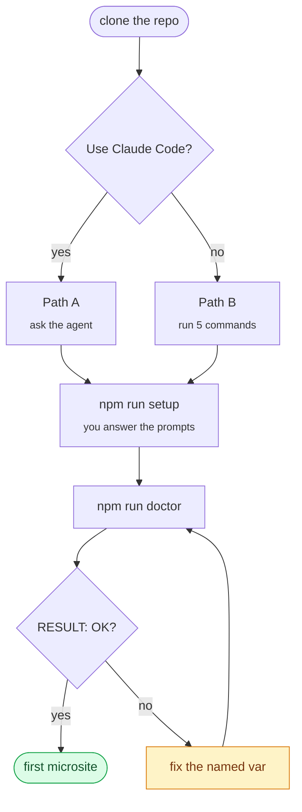
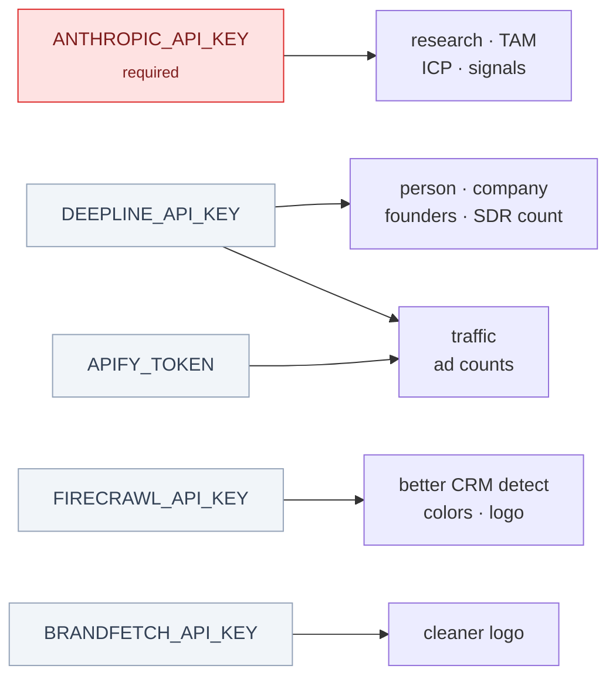

# Setup guide

Two ways through this, depending on whether you use [Claude Code](https://claude.com/claude-code):

- **[Path A — with Claude Code](#path-a--with-claude-code)** — an agent drives the setup and reads the errors for you.
- **[Path B — without Claude Code](#path-b--without-claude-code)** — plain terminal, every command written out.

Both end in the same place. Path B is the source of truth; Path A just automates it.



---

## Prerequisites

Needed for both paths.

| What | Why | Check |
|------|-----|-------|
| **Node.js 20+** | `node:` imports and a native `better-sqlite3` build | `node --version` |
| **An Anthropic API key** | The only required key — drives research, TAM, ICP, signals | [console.anthropic.com](https://console.anthropic.com/settings/keys) |
| **~500MB disk** | Chromium, which prints the PDF | — |

On Node 18 or below, `npm ci` fails while compiling `better-sqlite3`. That error is the symptom; the fix is upgrading Node.

**Cost.** One lead is a handful of Claude calls — typically a few US cents with the default setup. Each step records its own `cost_usd` and every run prints a per-step summary, so you can watch the real number rather than trust an estimate. Optional providers bill under their own pricing.

---

## Path A — with Claude Code

The repo ships a `setup` skill at [`.claude/skills/setup/`](.claude/skills/setup/), so Claude Code already knows this project's setup flow.

**Step 1.** Clone and open the repo:

```bash
git clone https://github.com/udaykang-byte/microsite-pipeline.git
cd microsite-pipeline
claude
```

**Step 2.** Ask for setup:

```
Set up this repo for me.
```

Claude will check your Node version, install dependencies and Chromium, and hand the terminal to you for the wizard.

**Step 3.** Answer the wizard prompts yourself. Claude deliberately won't do this part — the skill instructs it never to type your API keys or pipe input into the wizard. Your keys stay between you and the terminal.

**Step 4.** Ask Claude to verify:

```
Run the doctor and tell me what's missing.
```

It reads the RUN/SKIP table and explains any failure in context — which is the real benefit here: `RESULT: FAIL. Missing required var(s): ANTHROPIC_API_KEY` becomes a sentence about what to do next.

**Step 5.** Generate one:

```
Generate a microsite for https://www.linkedin.com/in/some-founder at acme.com
```

If a step errors, ask Claude to look at it — every step records its error, and it can read them all at once.

> **On keys:** the skill tells the agent never to print, echo, or `cat` a key value, and never to write real keys into `.env.example`. If you ever see it about to, stop it — that's a bug, please [open an issue](https://github.com/udaykang-byte/microsite-pipeline/issues).

---

## Path B — without Claude Code

Five commands. Nothing here assumes any tooling beyond Node and git.

### Step 1 — Clone and install

```bash
git clone https://github.com/udaykang-byte/microsite-pipeline.git
cd microsite-pipeline
npm ci
```

`npm ci` (not `npm install`) installs the exact locked versions.

### Step 2 — Install Chromium

```bash
npx playwright install chromium chromium-headless-shell
```

A few hundred MB, and only needed for the PDF. Skip it and everything works except the final PDF print.

### Step 3 — Run the setup wizard

```bash
npm run setup
```

It asks three questions — verifying your keys against the real APIs as you paste them — then writes `.env`:

| # | Question | Default | Notes |
|---|----------|---------|-------|
| 1 | How the AI steps run | `api` | Your `ANTHROPIC_API_KEY`, or a local `claude` CLI on a subscription. |
| 2 | Research backend | `claude` | Reuses the key from step 1. Parallel/Perplexity optional. |
| 3 | Optional provider keys | skip all | Press Enter past each. With a Deepline or Apify key it also asks the traffic/ads route (`ADS_TRAFFIC_PROVIDER`). |
| 4 | — | — | Writes `.env` (chmod 600), creates `./output` and the database. |

Results always land locally: a SQLite file plus rendered decks in `./output`. No accounts needed.

**Press Enter to accept a default, or to skip any optional key.** A skipped key means that step skips cleanly at run time — the deck still renders, just with fewer pages filled in.

The wizard needs a real terminal. For CI or containers, use `npx tsx scripts/init.ts` instead — it copies `.env.example` without prompting, and you edit it by hand.

### Step 4 — Verify

```bash
npm run doctor
```

You want `RESULT: OK.` at the bottom. Read it like this:

| Output | Meaning |
|--------|---------|
| `RESULT: OK.` | Ready. A lead can produce a deck. |
| `RESULT: FAIL. Missing required var(s): X` | Set `X` in `.env`. Re-run `npm run setup`, or edit the file. |
| Several steps show `SKIP` | **Normal.** Those providers' keys are absent; the deck renders at lower fidelity. |
| `Render: the core AI steps can't all run` | No deck will be produced — almost always a missing or invalid `ANTHROPIC_API_KEY`. |

### Step 5 — Generate your first microsite

```bash
npx tsx scripts/run.ts \
  --lead-url "https://www.linkedin.com/in/some-founder" \
  --name "Jane Doe" \
  --company "theircompany.com"
```

`--company` is the **domain** (`acme.com`), not the display name. Without a Deepline key this is what seeds the company, so the research and render steps can still run.

Then view it:

```bash
npx tsx scripts/serve.ts     # open the printed URL
```

Your files are at `./output/{leadId}.html` and `./output/{leadId}.pdf`.

To see everything the pipeline produced for a lead — the full research brief plus every enriched field, as markdown:

```bash
npx tsx scripts/inspect.ts           # lists leads
npx tsx scripts/inspect.ts <leadId>  # writes output/<leadId>.report.md + .research.md
```

---

## Adding more keys later

Every optional key fills in more of the deck. You never have to add them up front.



To add one, either re-run `npm run setup` (it offers to overwrite `.env`, defaulting to *no*), or open `.env` and fill the value in directly. Then re-run `npm run doctor` to confirm the step flipped from SKIP to RUN.

**Traffic + ad counts run through either provider.** `DEEPLINE_API_KEY` alone covers them via Deepline's native DataForSEO and Adyntel tools — no Apify account or actor picks needed. With both keys set, `ADS_TRAFFIC_PROVIDER` in `.env` picks the route: `auto` (default — Apify first, Deepline fallback), `apify`, or `deepline`. The doctor's step-plan table shows which route is live.

---

## Troubleshooting

| Symptom | Cause | Fix |
|---------|-------|-----|
| `npm ci` fails on `better-sqlite3` | Node < 20 | Upgrade Node, delete `node_modules`, `npm ci` again |
| "browser not found" at the PDF step | Chromium missing | `npx playwright install chromium chromium-headless-shell` |
| Wizard says "needs an interactive terminal" | stdin was piped | Run it directly, or use `npx tsx scripts/init.ts` |
| Startup fails naming a missing variable | Required var empty for your switches | `npm run setup`, or edit `.env` |
| Key rejected during setup | Typo, or a revoked key | Re-paste. The wizard re-asks rather than saving a dead key. |
| Many steps SKIP | Optional keys absent | Expected — add keys to fill in more of the deck |
| Render gate rejects the lead | A core AI step didn't produce output | `npm run doctor` to find which, then check that step's recorded error |
| A step failed, you fixed the cause | Steps are idempotent; `done` won't rerun | `npx tsx scripts/run.ts --lead <uuid> --force --step <name>` |

---

## Keeping keys safe

- Keys live in `.env` only. It's gitignored, and the wizard writes it `chmod 600`.
- `.env.example` holds empty placeholders — never put a real value there.
- If you ever commit a key, **revoke it at the provider immediately**. Rewriting git history does not make an exposed key safe.
- Set spend limits on paid APIs while you're getting a feel for costs.

See [SECURITY.md](SECURITY.md) for the full policy and how to report a vulnerability.
